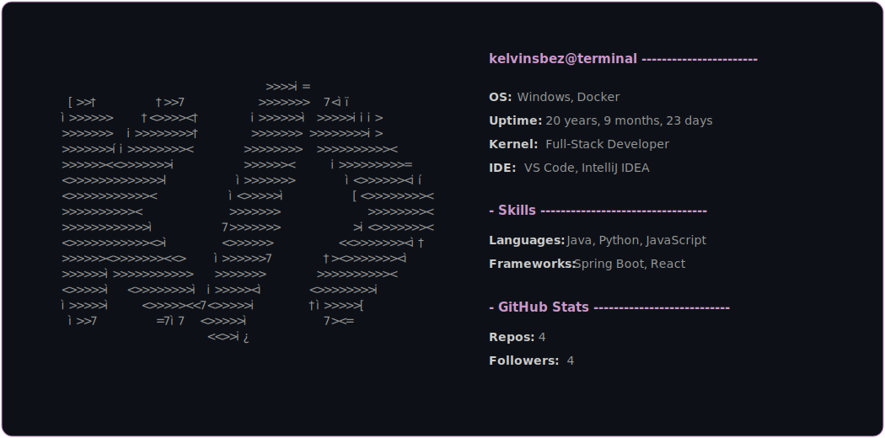

  <picture>
    <source media="(prefers-color-scheme: dark)" srcset="assets/profile-dark.svg">
    <source media="(prefers-color-scheme: light)" srcset="assets/profile-light.svg">
    
  </picture>
  
  <h3>Hey there! I'm Kelvin 👋</h3>
  
  

    
    
    
  

---

### Sobre mim

Olá! Sou graduando em Ciência da Computação e desenvolvedor focado em arquiteturas robustas para a web. Busco constantemente criar códigos limpos, performáticos e que entreguem uma ótima experiência de uso.

* 🛠️ **Projetos:** Atualmente focado no ecossistema do **Agrupaê** e outros projetos...
* 🇩🇪 **Idiomas:** Expandindo horizontes estudando **Alemão**.

---
### Tecnologias e Ferramentas

  
  
 
  
  
  
  

---

### Estatísticas do Github

  <picture>
    <source media="(prefers-color-scheme: dark)" srcset="https://github-readme-stats.vercel.app/api/top-langs/?username=kelvinsbez&layout=compact&langs_count=8&locale=pt-br&title_color=c9c&icon_color=c9c&text_color=c9d1d9&bg_color=0d1117&border_color=c9c">
    <source media="(prefers-color-scheme: light)" srcset="https://github-readme-stats.vercel.app/api/top-langs/?username=kelvinsbez&layout=compact&langs_count=8&locale=pt-br&title_color=c9c&icon_color=c9c&text_color=24292f&bg_color=ffffff&border_color=c9c">
    
  </picture>

  <picture>
    <source media="(prefers-color-scheme: dark)" srcset="https://github-readme-streak-stats.herokuapp.com/?user=kelvinsbez&theme=dark&background=0d1117&ring=c9c&fire=c9c&currStreakNum=c9d1d9&sideNums=c9d1d9&sideLabels=c9d1d9&dates=c9d1d9&border=c9c">
    <source media="(prefers-color-scheme: light)" srcset="https://github-readme-streak-stats.herokuapp.com/?user=kelvinsbez&background=ffffff&ring=c9c&fire=c9c&currStreakNum=24292f&sideNums=24292f&sideLabels=24292f&dates=24292f&border=c9c">
    
  </picture>

